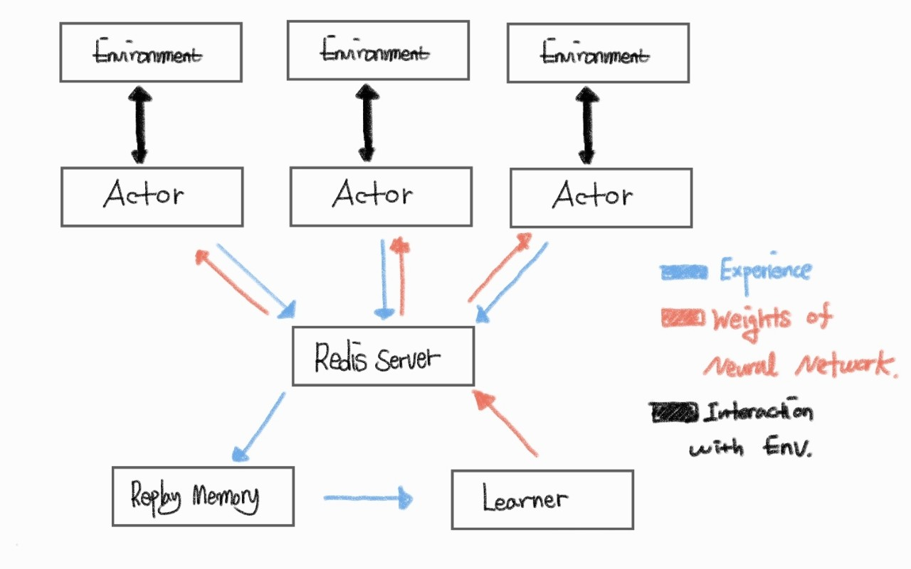

# Distributed Reinforcment Learning.

## Description

This Repo is for implementation of Distributed RL,

using by **Pytorch, Ray and Redis.**

Here is list of Algorithm I implemented (or will implement)

## Algorithms

1. Soft Actor Critic

2. V_Trace, IMPALA

3. Muzero

4. R2D2

## Install

    Recommend you create the new development conda env for this repo.

    conda create -n <env_name> python=3.6

    git clone https://github.com/seungju-mmc/Distributed_RL.git

    git submodule init

    #  pull submodule from git 'baseline'
    #  If you read Readme.md from baseline, understand what it is.

    git submodule update
    
    pip install -r requirements.txt

 **[Important] if you use mujoco environment, you must install mujoco-py from this.**

**[Important] you must check ./cfg/algorithm.json. you can control the code by .json.**

 ## Run

    python run_sac.py --train --num-gpu=1 --num-cpu=8