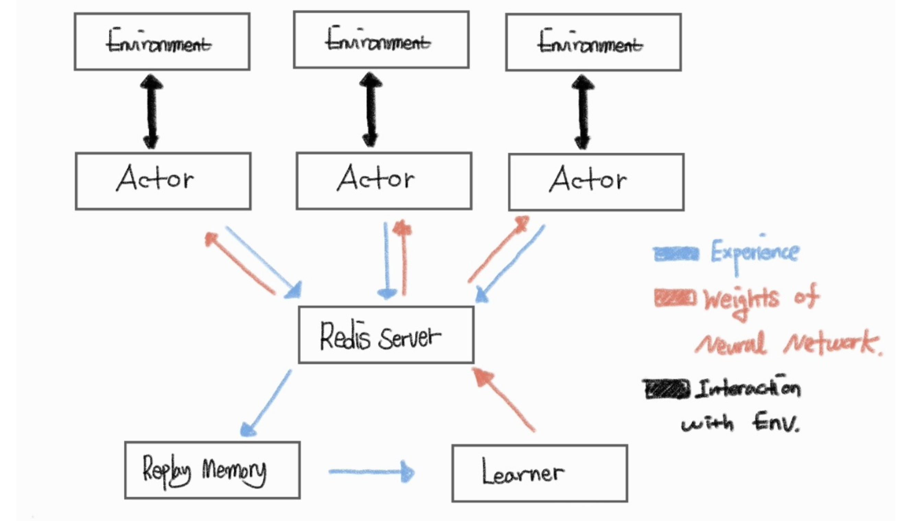

# Distributed Reinforcment Learning.

## Description

This Repo is for implementation of Distributed RL Algorithm,

using by **Pytorch, Ray and Redis.**

Here is list of Algorithm I implemented (or will implement)

## Algorithms

1. IMPALA

2. APE_X_DQN

3. R2D2

## Install

    Recommend you create the new development conda env for this repo.

    conda create -n <env_name> python=3.6

    git clone https://github.com/seungju-mmc/Distributed_RL.git

    git submodule init

    #  pull submodule from git 'baseline'
    #  If you read Readme.md from baseline, understand what it is.

    git submodule update
    
    pip install -r requirements.txt

**[Important] you must check ./cfg/<algorithm>.json. you can control the code by .json.**

**[Important] In configuration.py,  set the path !!**

 ## Run

    #  you need independent two terminals. Each one is for learner and actor.

    sudo apt-get install tmux

    tmux

    python run_learner.py

    # Crtl + b, then d

    tmux

    python run_actor.py --num-worker <n>

## BottleNecks

    1. More Cache memory, Better performance

        I observed that lower cache memory of intel i7 9700k (12Mb) can be siginificant bottleneck for constructing data pipeline. You can check following lines in bash

    
    sudo lshw -C memory